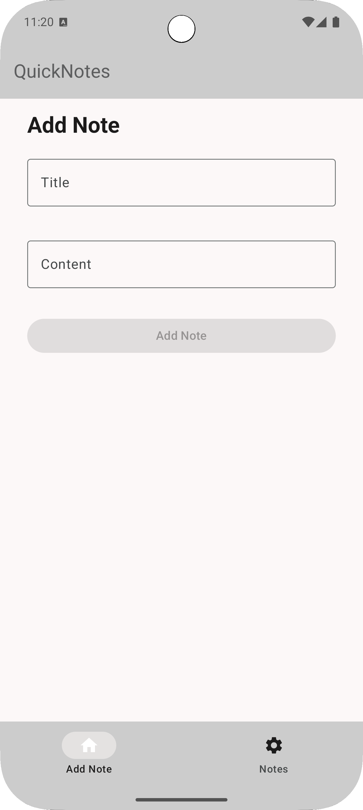
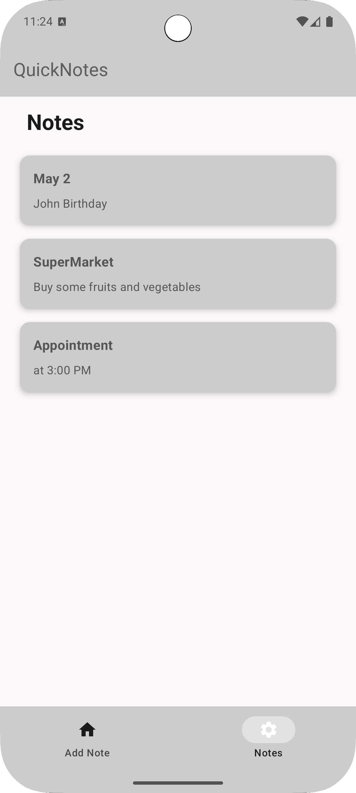
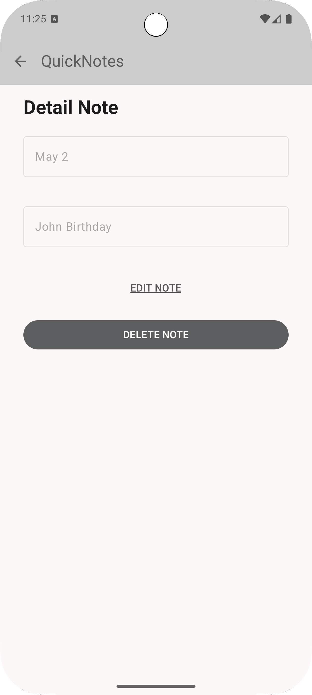
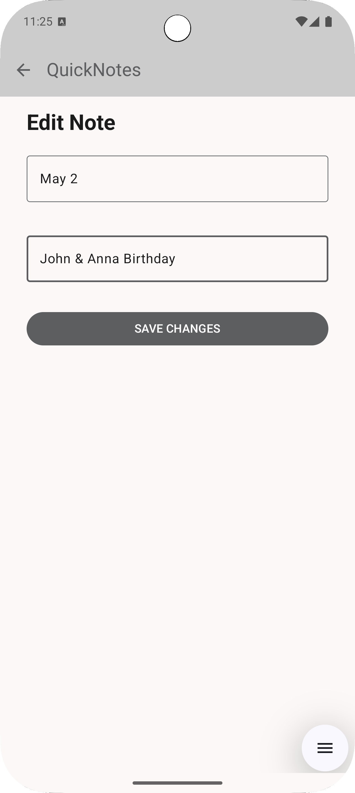
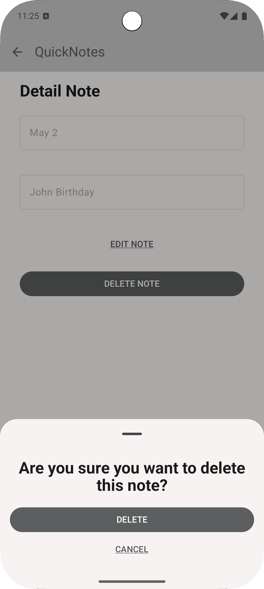

# QuickNotes

## ✨ A Minimalist and Efficient Notes App

QuickNotes is a notes application designed to provide a smooth and simple experience for creating and managing notes. With an intuitive interface built following Material Design 3 principles, QuickNotes allows users to quickly organize their ideas and access them efficiently.

## ⚙️ Technologies Used

QuickNotes is developed using the following technologies:

- **Kotlin** 💪 - Primary development language.
- **Jetpack Compose** 🎨 - For a modern and declarative UI.
- **Firebase** 💡 - For cloud storage and note synchronization.
- **Hilt** ⚖️ - For dependency injection.
- **Coroutines** ⏳ - For efficient threading and asynchronous tasks.
- **MVVM** 🔍 - Architecture based on recommended Android patterns.
- **Clean Architecture** 🔄 - For a scalable and maintainable structure.

## 📷 Screenshots

   
   


## ⚡ Main Features

- Add, edit, delete, and list notes easily.
- Firebase synchronization for multi-device access.
- Support for light and dark modes.
- Modern design based on Material 3.
- High performance thanks to coroutines and optimized architectures.

## 🔗 Installation and Usage

1. Clone the repository:
   ```sh
   git clone https://github.com/aldourtusuastegui/QuickNotes.git
   ```
2. Open the project in Android Studio.
3. Ensure Firebase is configured in your project (add google-services.json).
4. Build and run the application on a device or emulator.

## ✨ Contributions

If you want to contribute to QuickNotes, follow us on GitHub and submit your pull requests. All help is welcome.

## 🌟 Credits

Developed by [Aldo Urtusuastegui].

## © License

This project is licensed under the MIT License - see the [LICENSE](LICENSE) file for details.

